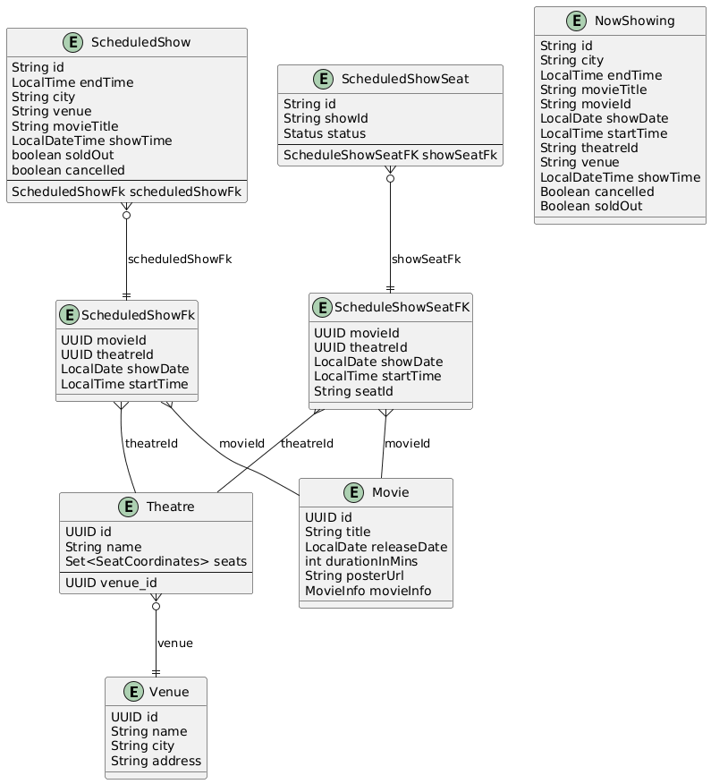
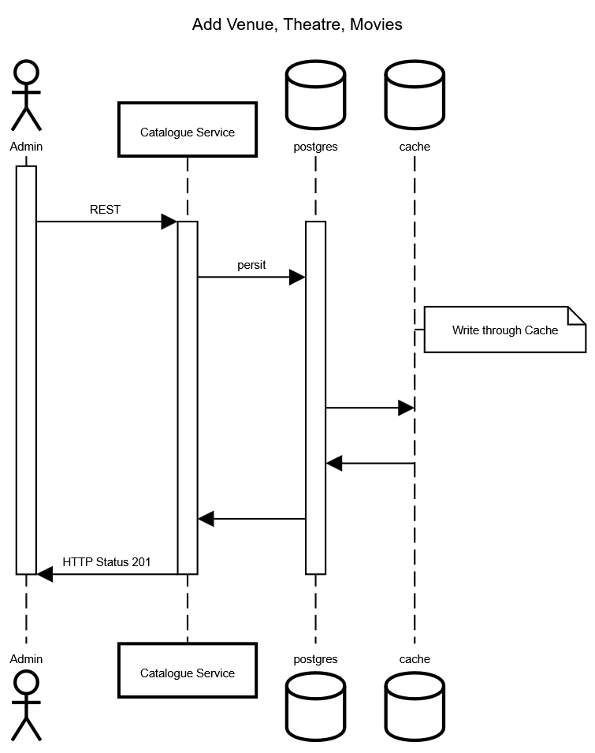
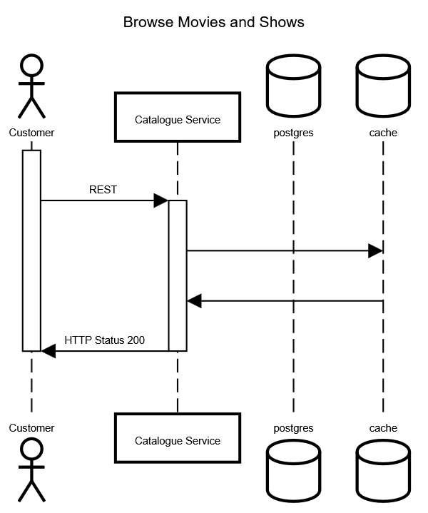
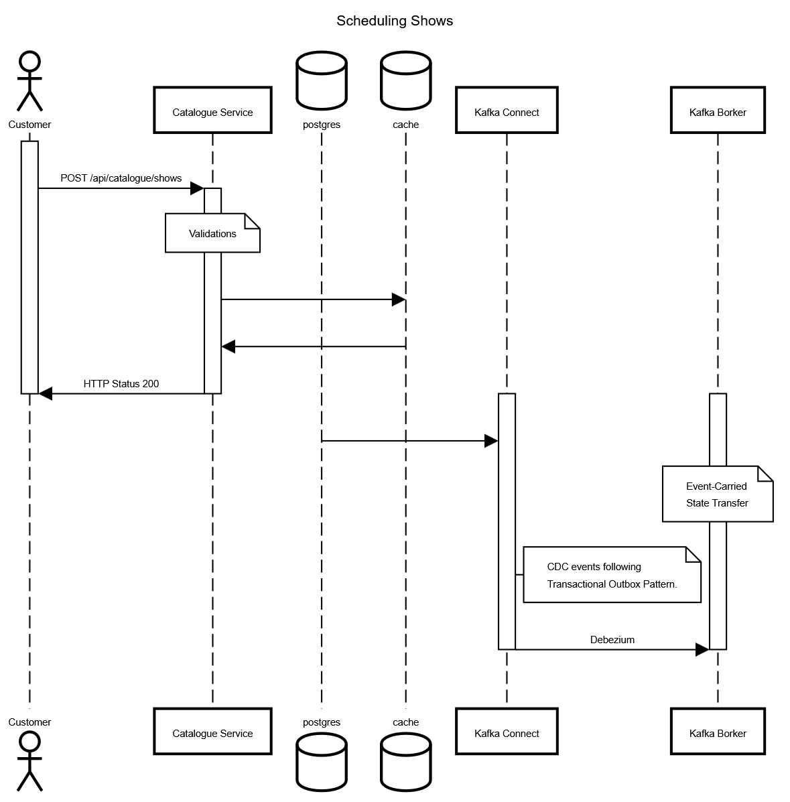

# JustBookIt

Online event booking platform to enable customers to book movie tickets online from multiple channels like web and
mobile. Customers can browse movie catalogues and book tickets by selecting the city, theatre, and show timing. The
company is a theatre aggregator and collaborates with them for movie showtimes and inventory of seats for a seamless
booking experience without conflicting with over-the-counter booking at theatres.
  **NOTE**: Not all features mentioned here will be implemented as deliverable for the evaluation.

## Actors Involved

### Customer

Individuals trying to book tickets for events or shows through the platform. They can browse events, select seats, and
make payments though the web or mobile application.

### Event Organizer

Organizations or individuals hosting events. They own and manage venue, event details, seating arrangements, and ticket
pricing. They communicate physical details of the event venue and recurrence nature of the event with the booking
platform, through integrations or manually through the back-office portal.

### JustBookIt Admin

Back office administrators and staff who oversee the platform's operations, manage user accounts, and handle disputes or
issues,
analyzing platform performance and user behavior, reports, and ensuring smooth operation.

## Functional Requirements ( Scoped for MVP )

- Browse movie catalogues by city
- Browse theatres currently running the show (movie selected) in the town, including show timing by a chosen date
- Book movie tickets by selecting a theatre, timing, and preferred seats for the day
- Theatres can create, update and delete shows for the day
- Theatres can allocate seat inventory and update them for the show
- Booking platform can introductory rollout offers in selected cities and theaters
    - 50% discount on the third ticket
    - Tickets booked for the afternoon show get a 20% discount

## Non-Functional Requirements

- Scalability: The system should handle a large number of concurrent users and bookings, especially during peak times.
  The system is read heavy, and thus needs to be able to support high read throughput (100:1)
- The system should prioritize availability for searching & viewing events, but should prioritize consistency for
  booking events (no double booking)
- Reliability: Ensure high availability and fault tolerance to minimize downtime and service interruptions.
- Performance: The system should provide quick response times for browsing events, booking tickets, and processing
  payments.
- Security: Implement robust security measures to protect user data, payment information, and prevent unauthorized
  access
  to the system.
- Adhering to SLA for response times for user actions and system processes.

### Rough Estimates for MVP

- Monthly booking 15 million tickets
- Peak booking rate: 200 bookings per second
- Average booking rate: 50 bookings per second

## High Level System Components

Given the large scale of the platform, the system is designed with a microservices architecture to ensure scalability,
maintainability, and flexibility. Each component has its Bounded Context around inventory and other abstractions and can
be
developed, deployed, and scaled independently. Each system builds its bounded context using patterns like Outbox
pattern,
Event Sourcing, CQRS, etc. as applicable.

  Proposal is to  build the system using Event Driven Architecture using Kafka as the event bus to ensure loose coupling
between services and to facilitate asynchronous communication. 

[Event Driven](https://martinfowler.com/articles/201701-event-driven.html)

  The key components involved in the system includes:-

### Web and Mobile Application

Only secured access permitted for operations except browsing events by the customers.

- For customers to browse events, select seats, and make payments.
- For JustBookIt Admins to manage the platform through a back-office portal.
- For Event Organizers to manage their events, if they do not have their own systems.

### Catalogue Service

- Onboarding Venue, Movies and schedules of their screening.
- Once a movie is scheduled, the seat inventory is allocated for the show.
- Manages event/movies, venue listings, details, and eventually consistent availability.
- Provides search and filter functionalities for users to find events based on various criteria.

### Booking Service

- Handles the booking process, including reservation, and confirmation.
- Manages booking statuses and user booking history.
- Ensures real-time seat availability to prevent double bookings.
- Implements a timeout mechanism to release unconfirmed bookings after a certain period.
- Supports booking modifications and cancellations, adhering to the platform's policies.
- Integrates with the payment gateway to process payments securely.

### Payment Gateway Integration

- Facilitates secure payment processing for bookings.
- Supports multiple payment methods (credit/debit cards, digital wallets, etc.).
- Ensures compliance with relevant security standards (e.g., PCI-DSS).
- Handles payment confirmations and failures, updating the booking status accordingly.

### Notification Service

- Sends booking confirmations, reminders, and updates to users via email or SMS.
- Notifies event organizers of new bookings and cancellations.
- Provides alerts for any changes in event details or booking status.

### Back Office Admin Portal

- Allows JustBookIt Admins to manage user accounts, events, and bookings.
- Provides tools for handling disputes, refunds, and customer support.
- Offers analytics and reporting features to monitor platform performance and user behavior.

### External Integration Service

- The event organizer may have their own systems to manage events. The booking platform needs to integrate with these
  systems to
  fetch event details, updates, and cancellations.
    - Supports webhooks or APIs to receive event details, updates, and cancellations from organizers.
  - Ensures eventual data consistency and synchronization between the booking platform and external systems.
- There also could be event managers that do not have their own IT systems at all and rely solely on JustBookIt for
  event
  management.

### Settlement and Reconciliation Service

- Manages financial settlements with event organizers with agreed SLA for e.g T+1 days
- Handles reconciliation of payments, refunds, and commissions.
- Generates financial reports for accounting purposes.

### Backend For Frontend

- Primarily stateless service which serves as single point of access for web and mobile client
- Host the frontend application static resources
- Aggregates data from multiple microservices to reduce the number of client requests
- Interacts with other microservices over faster and secured VPN, reducing latency especially over slow network

### Data warehousing and Analytics

- ELT pipelines to extract, load, and transform data from various services into a centralized data warehouse.
- Analytics tools to generate insights and reports for business decision-making.
- Improve efficiency of OLTP database by moving cold data to OLAP database.

### Key Data Models

- **User**: Represents customers and admins with attributes like user ID, name, email, password, role, and contact
  details.
- **Venue**: Represents the physical location where events are held, including attributes like venue ID, name, address,
  city.
- **Theatre**: Represents individual theatres within a venue, including attributes like theatre ID, name, seating
  capacity,
  and layout.
- **Movie**: Represents movies with attributes like movie ID, title, genre, duration, language, and description.
- **ScheduledShow**: Represents scheduled screenings of movies, including attributes like show ID, movie ID, theatre ID,
  date, time,
  and seat inventory.
- **ScheduledShowSeat**: Represents individual seats within a theatre for a given scheduled show. This is the primary
  Inventory items that gets booked and sold.

## Key Sequence Diagrams

### Onboarding Venue,Theatres and Movies

**Venues** and **Theatre** are onboarded in system by JustBookIt Admins or through Integration channel. These operations
are not frequent and required very low throughput.  

**Movies** are also onboarded by JustBookIt Admins or through Integration channel. These operations are not frequent and
required very low throughput.  

These details are relatively static and do not change often.  
[Link](https://sequencediagram.org/index.html#initialData=EYewLmILYA4IYCcwEsDGz4DswGcBQKYANgKYAEAggCZVkBqJmAriQDRkAqAFiXGAmzIBZEADdkJfHFSQEZAETUoyTPLJwc6vPCRoMcbAoDCfOERABzFmQDKJBONQk1GsqnxVTwDeXkwQOGAWAjgumlTAeJ5gcN44vqjSPGFueGl40iiifORwaXAAtAB87gBcAEoAojYcZBkyyNlg5O71WTlkEXjuxRGlMPY4yGB4mODkCMgWXGBkIABmbqUA6pPNZGBcCCBM02QmqDxRwMWopd29wOcRpzjnPUVwpQASHBwACrYxYEyaAEwABgAjFFeA0muQulQwe11q1oZlGh08uk0kA)

### Browsing/Searching Shows and Movies

[Link](https://sequencediagram.org/index.html#initialData=EYewLmILYA4IYCcwEsDGz4DswGcBQKYANgKYAEAQgiAO47kCyIAbsiTmXJgCZkDKAC1r44qSAjIAiAMIBXHJCgkEkzhzh54SNBi5gp0uGDhEQAc1nk+y1qhKq4HVPm5G4wR+UkwQCswnYHDm5gPFdjD3opVFEBezUyVDxkvFEUZiNyDVSAWgA+ZwAuACUAUT4AFTJUsWQMsHJnZOd81EKUvFRWnHaWvLhCgAkKioAFfmMweTIAJgAGOeTuEjS6zMSXFdr6rI7koA)

### Scheduling Shows

### Booking Movie Tickets

[Link](https://sequencediagram.org/index.html#initialData=C4S2BsFMAIBUQMYGtLGgIQPaaSAdgObQBi4mA7gFCUCGCwmATtAKoDOkjlADjY6AhC88aAEQBBAAoBJaAHEawSORoBPUdBpt5AdR58BQmiOiisOfEQDKnAG6JIGrRiv7+iIydGS1AW0gmNoz2CI6a2pKuvO6CwmIAcpigAGaIiiCYeNpBIWHO8a6UAMTQkgAWWjAAjABc0NJ4YCCKMOa4hJp4ACbQABKY4D02itTsnAC0AHxyOnWSAPJWsNAA9ABG2O0E2gAUHIrSXQA00JC2AcCHAJSUM1PoVnUIjJAtbZZ7r5fHp+cihycAK4cRjXWj0EC2Fouah4JIwTDnZgPOoAYTKkGQ2n2aBoUJA4BoawJYFU0AAZNBuITQtoaNAygMevhoGBtBQ8NAuooiZUAHSUB7jKYzOoAb2gGwshAB0DYwEUwLmAFF4gARaTxOQAfUk4gAmgBZVXLAC+tx0wsmY0Yc0YmFCkB6DCpfgu0B2Uq2YOKpQqHGgACY7Q7IGwIm6RKMQSLZqVFssVrxVP4RLsvZZZcnU8A1agaAS2Dc7pMUVT7bS2D4UxdPZtMz9sxc8wrCzdBVYppEni8WtWczsaL5MICRCcMzKujc6KAoUpSq44fPGCACGU0Jhkgu6g0lIwZ9pyGAyqcAB57vA0cClSNoBRKFRknaQPkEPknKzAFfcSAnas+cAbkiK0ywlJsRE-RU2DqKwWFRVFlSsKxoHNLpXghOcYEiagSnKSpoAAZjRTJUkYXxoCYEgC2vYAMQwetCGoK80HAtAVGxQEEErZJAXAShoAE6AlwRJEXDqFhuG5JRsS+OUFWAYFoGSe1yN6ZUABk1WgF10HmeYAGllS0lk2S5Hk1n5fjBKsgShUmAo6g4bp3kIVESJAMj0kyHZgU4WUBBQXN8zbGyXCtUVoAlCcCEghToOgVF5niYhpAAJWNNUTgC1A6j5PKUNCu4phtOoXOsTjuN4gBCahIHAANWKU6inQo5hQH8HoR2AULhIo0Sy1SurXg4GTFAZJkPXlKDoCmaBxAANXEaR1PEdB1OVK5WU5UypN5DgBUE6BQrshy5QCLp+wuYhqMBF5EhSNJQG83zQR+Xs2EyG5DqFWNxUlBiYvkpUSCW9bMugd7Mjqbxby5TFwHwJ0NHNQ6iutEFSoBqiCSdPlSigfCvzJGgCALPABXO6g0JnSFoQeIA)

## Technology Stack

- Frontend:
    - React.js/Angular for web application, React Native for mobile application.
    - Fullstack friendly framework like Vaadin Flow, Vaadin Hilla can also be considered.
- Backend
    - Java 21/24
    - Spring Boot Framework
        - Spring Web for building RESTful APIs
        - Spring Data JPA/JDBC for database interactions
        - Spring Security for authentication and authorization
        - Spring Kafka for event-driven communication
        - Spring Cache for caching mechanisms
        - Spring Actuator for monitoring and management
    - Kafka 4.x for event streaming and messaging
    - PostgreSQL 17.x for relational database management
  - Redis 7.x for caching and session management(For MVP, can be skipped in favor of JDBC based locking)
  - Docker for containerization
  - Kubernetes for container orchestration and management
  - Prometheus and Grafana for monitoring and alerting
  - API Gateway (e.g., Spring Cloud Gateway, Kong, or AWS API Gateway) for routing and managing API requests,
    including rate limiting, authentication, and logging.
  - Content Delivery Network (CDN) (e.g., Cloudflare, AWS CloudFront) for delivering static assets and improving
    application performance.
  - CI/CD Tools (e.g., ArgoCD, Jenkins, GitLab CI/CD, or GitHub Actions) for automating the build, test, and
    deployment processes.
  - Testing Frameworks (e.g., JUnit, Mockito, Postman) for unit, integration, and end-to-end testing.
  - Cloud Provider (e.g., AWS, Azure, or GCP) for hosting and managing infrastructure.
  - Security Tools (e.g., OWASP ZAP, Snyk) for vulnerability scanning and ensuring application security.
  - Documentation Tools (e.g., Swagger/OpenAPI) for API documentation and testing.

## Future Enhancements and Left Outs

Due to time constraints, the following aspects are not implemented completely in the MVP:

- Robust error handling across all services
- Retry Mechanism for transient failures
- Graceful shutdown of services
- Circuit Breaker pattern for external service calls
- Rate Limiting to prevent abuse and ensure fair usage
- Caching strategies for frequently accessed data
- Comprehensive logging and monitoring
- API documentation using Swagger/OpenAPI
- Unit and Integration tests

## How Does it integrate with Theatres

The JustBookIt platform needs to integrate with multiple theatres. Some of them might have their own IT systems, while
others
might not have any systems at all. Depending on nature of the theatre, the integration approach will vary. Some possible
approaches:-

1. All In - Venues and Theatres that do not have their own IT systems and rely solely on JustBookIt for event
   management. Theatres
   use the back-office portal to manage their events, seating arrangements, and ticket inventory. This will be best
   approach as one system becomes the source of truth.
2. Partial Integration - Venues and Theatres that have their own IT systems but are willing to integrate with JustBookIt
   for
   real-time seat inventory updates and booking confirmations. Integration can be done through APIs or webhooks. Also
   possible, that only limited inventory are sold through JustBookIt and some are reserved by venue itself.
3. Read-Only Integration - Venues and Theatres search and browsing only

#### Hows....

Depending on the integration approach, the following key aspects need to be considered:

- Seats’ inventories are flowing from theatres to the booking platform.
    - Admin Portal for theatres to manage their events, seating arrangements, and ticket inventory.
    - APIs or webhooks for theatres to push seat inventory updates to the booking platform.
- Bookings flowing to physical theatres’ IT system.
    - Theatres can receive booking confirmations and cancellations through APIs or webhooks.
    - Increases complexity as theatres need to handle incoming bookings and update their seat inventory accordingly.

- Theatres scale the seat's capacity with minimal downtime.
    - Onboarding new venues and theatres should be easy and quick.
    - Updating existing venues and theatres, and scheduled shows will require business validations - like cannot cancel
      a show if there are existing bookings without introducing refund flow.
- Integrate with numerous theatres with no control over their IT landscape
    - Need to support different integration approaches based on theatres' capabilities.
- Design a booking cancellation system and update theatres seat inventory in real-time.
    - Depending on the integration approach, cancellations may need to be communicated back to theatres.
    - Business validations and keeping systems in sync.
- Enable continuous improvement of platform and business without impacting existing ones.
    - CI/CD pipelines for automated testing and deployment.
    - Feature toggles to enable/disable features without redeploying the application.
    - Canary releases to gradually roll out new features to a subset of users.
    - A/B testing to experiment with different features and gather user feedback.
- How will you scale to multiple cities, countries and guarantee platform availability of 99.99%?
    - Dumb - Country wise deployment of the platform.
        - Easy for data residency and compliance requirements.
        - But expensive and complex to manage multiple deployments.
    - Smarter - Single deployment with multi-region support, but data partitioning based on country. More often, people
      will book tickets in their own country.
        - Ensuring data consistency and integrity across regions will be challenging.
    - Use of CDNs to deliver static assets and improve application performance.
    - Use of Load Balancers to distribute incoming traffic across multiple instances of the application.
- Structure it around incrementally rolling out the platform and choice of cloud technologies to handle the scale and
  simplicity.
- What cloud technologies will you choose to handle failover and provide resiliency